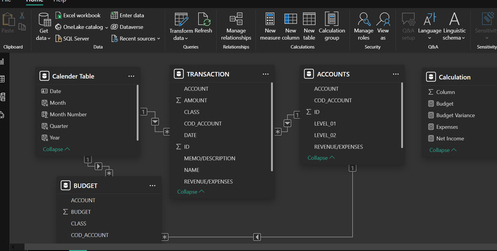

# SaaS-Finacial-Performance

### FP20 Financial Performance Analysis Report 

*Aligning Financial Insights with Strategic Decision-Making* 

*Written By Glory Obi*

## 1. Introduction 
In today’s dynamic business environment, financial visibility is a key driver of sustainable 
growth. This report evaluates the annual financial performance of SaaS(Software-as-a-Service), 
providing a comprehensive review of income, expenditures, revenue sources, and vendor 
relationships. By translating raw data into actionable insights, this analysis empowers business 
leaders to make informed, data-driven decisions that optimize budgets, enhance profitability, and 
improve marketing strategies. 

## 2. Problem Statement 
Despite generating consistent revenue, SaaS experienced periods where expenses surpassed 
income, budget forecasts were missed, and cost overruns occurred in key departments. These 
challenges raise questions:

• Are resources being allocated efficiently?

• Which areas are driving or draining profitability? 

• How can financial performance be optimized through data-backed decisions? 

The need for clarity and strategy is urgent, especially as the company aims to scale and align 
spending with business objectives. 

## 3. Skills Demonstrated 

This project highlights a range of data analytics competencies, including:

• Data Cleaning & Transformation using Power BI Query Editor 

• Data Modeling & Relationships (e.g., One-to-Many, Calendar table) 

• DAX Measures for creating KPIs like Profitability, &Budget Variance,

• Data Visualization & Dashboard Design to communicate insights clearly 

• Business Analysis tailored to financial, operational, and marketing decisions 

• Storytelling with data for non-technical stakeholders and policy-level discussions 

## 4. Data Source 
The dataset was provided by FP20 Data Challenge,  SaaS dataset simulating real-world 
financial operations. It included tables such as: 

• Transactions (real monthly financial transactions) 

• Budgets (planned monthly allocations) 

• Accounts 

## 5. Data Transformation & Modeling 

The following steps were taken in Power BI: 
• Data Cleaning: Replaced blanks, capitalized text, trimmed fields

• Column Creation: Added Variance, Total Profit, Over/Under Budget flags

• Calendar Table: Created for time-based analysis and monthly trends 

• Data Relationships: Linked transactions to budget, client, and vendor tables via keys 

• DAX Measures: Created KPIs like Total Revenue, Total Expense, Profit Margin, Highest 
Payout. 

## 6. Analysis Summary 

### A. Financial Overview & Performance 
1. Over the year, did the company spend more or less than planned? 
The company spent slightly more than planned, exceeding the ₦36.92M budget by ₦440K, 
resulting in a 1.20% variance. 
2. Was the company profitable each month, or did expenses exceed income at any point? 
The company was not profitable throughout the year. In most months—especially August to 
November, expenses exceeded income, leading to a net loss of ₦1M overall, despite a small 
recovery in early 2024. 
3. Which categories or accounts show the most significant difference between budget and 
actual figures? 
R&D and Admin departments had the largest variances, spending more than planned. On the 
other hand, Sales and Customer Success remained closer to budget.

### B. Revenue Insights 
4. What are the primary revenue sources, and which generates the most income? 
Gas and Administration is the only generating source, generating $18M revenue, however, 
revenue across the different accounts includes the following 
• SaaS Revenue: ₦14M  
• Product Sales: ₦4M 
• Interest Income: ₦59K 
5. How does revenue change over time — are there any seasonal peaks or slowdowns? 
Revenue shows stronger performance from July to December, with a noticeable slowdown from 
January to July. This suggests seasonal drops in business activity or delayed client payments 
during the latter part of the year. 
6. Which clients or deals brought in the highest individual payments? 
• ADP: ₦10.6M 
• GlobalTech: ₦3.6M 
• Hardware Inc: ₦2.2M 
These clients accounted for a major share of total revenue, highlighting reliance on a few 
high-value clients. 
7. Were there specific months when revenue was noticeably lower than planned? 
Yes — August, September, October, and November had lower-than-expected revenues, 
contributing to the year-end net loss.

### C. Expense Insights 
8. What are the top 5 spending categories by total amount? 
1. Bills – 50.98% 
2. Invoices – 47.90% 
3. Expenses – 0.20% 
4. Entry -0.76% 
5. Deposit – 0.16% 
9. Which vendors or service providers received the most money overall? 
• ADP, Hardware Inc, United Health, AWS, and Google Ads are among the top recipients, 
showing high spend on cloud services and advertising. 
• Other major vendors include payment and software platforms like Stripe. 
10. Are there any expense categories that regularly exceeded their budget? 
Yes — R&D and Admin regularly overspent compared to budget. This suggests either under
budgeting or unplanned expenses. 
11. In which months did spending increase sharply, and what caused it? 
September and October saw sharp spending spikes, mostly due to high bills, invoice payments, 
and possible quarterly vendor settlements.

 
 
### D. Trends & Patterns 
12. Are there any repeating monthly or seasonal patterns in revenue or spending? 
Yes — 
• Revenue tends to peak in Q1 and early Q2, while Q3 and Q4 show consistent declines. 
• Expenses remain high throughout but spike around Q3, showing an imbalance between 
income and spending during the second half of the year. 
13. Which months show the best alignment between budgeted and actual figures? 
• January, February, and April show the closest alignment between budget and actuals, 
both in terms of income and expense control.

## Conclusion 
The company demonstrated strong revenue-generating potential with a total of ₦37M in 
transactions, primarily driven by SaaS services and a few high-value clients like ADP, Hardware 
Inc, United Health, AWS and Google Ads. However, expenses consistently outpaced income, 
particularly in the second half of the year, resulting in a net loss of ₦1M. Operational 
overspending—especially in R&D and Admin—alongside seasonal revenue slowdowns and high 
vendor payments (e.g., AWS, Google Ads), significantly contributed to this imbalance.

## Recommendations 
### 1. Improve Budget Discipline 
o Reassess and tighten budget allocations for R&D and Admin departments. 
o Consider monthly budget tracking to identify overspending early. 
### 2. Diversify Revenue Sources 
o Reduce dependency on a few major clients by expanding the client base or 
developing new product lines. 
o Explore upselling and cross-selling opportunities with current clients. 
### 3. Manage Vendor Costs 
o Renegotiate contracts with top vendors (e.g., AWS, Google Ads). 
o Audit service usage to ensure you're only paying for what’s essential. 
### 4. Enhance Cash Flow Planning 
o Implement cash flow forecasting to prepare for seasonal drops in revenue. 
o Consider setting aside reserves during high-income months to offset Q3/Q4 
downturns. 
### 5. Leverage Financial Analytics 
o Invest in real-time dashboards for better visibility into budget vs. actuals. 
o Use historical trends to predict low-revenue periods and plan proactive strategies. 
6. Evaluate Monthly Profitability 
o Set clear monthly profitability targets to guide decision-making. 
o Encourage department heads to report variances and justify spending. 
